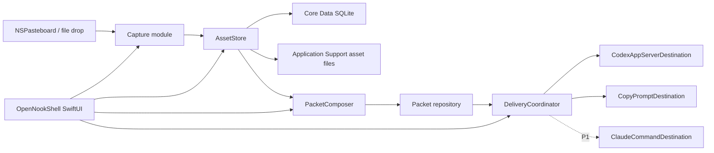
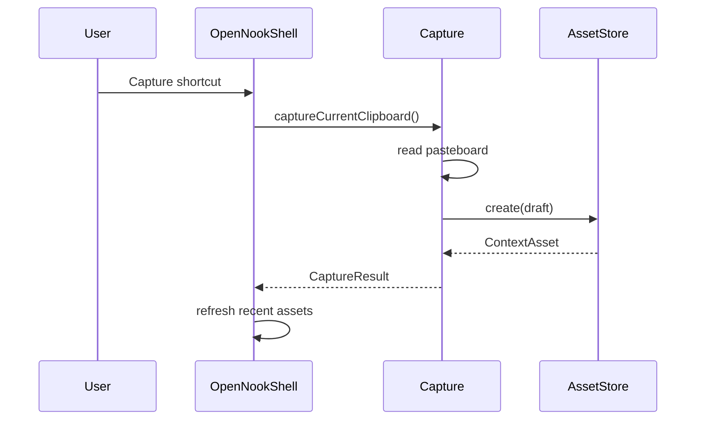
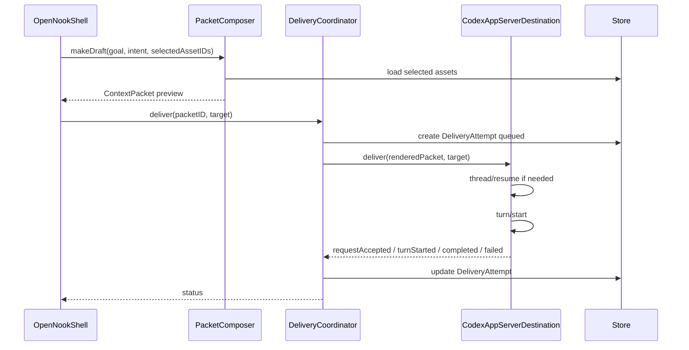

# onpaper Technical Design

Status: Draft  
Date: 2026-07-05  
Related PRD: `docs/onpaper-prd.md`

## 1. Summary

onpaper is a native Swift macOS app built on OpenNook. The app's differentiating module is not the notch shell; it is the local context pipeline:

```text
explicit clipboard capture
  -> durable ContextAsset
  -> ordered ContextPacket
  -> destination-specific delivery payload
  -> DeliveryAttempt audit trail
```

The MVP is Codex-first. It must send a packet to an existing Codex thread through Codex app-server. Claude remains a later destination adapter, behind a fake command-runner seam until local Claude Code CLI capabilities are verified.

The design deliberately separates:

- OpenNook shell and SwiftUI presentation
- capture and asset persistence
- packet composition
- destination-specific delivery mapping
- delivery status and retry audit

This separation is required because OpenNook, Codex app-server, and Claude CLI each have different volatility and testing needs.

## 2. Evidence And Constraints

### Verified locally

- `/Users/justin/workspace/opennook` is a SwiftPM package with `NookApp`, `NookKit`, `NookSurface`, and optional `NookComponents`.
- OpenNook targets macOS 15+ and exposes public customization through `NookConfiguration` and `NookApp.main`.
- `NookConfiguration` supports expanded home content, compact leading/trailing slots, top-bar actions, settings sections, lifecycle hooks, `onFileDrop`, and `onReady`.
- `AppServices` is a per-module dependency container threaded into SwiftUI via `\.appServices`.
- `NookFilePicker` handles file panels from a nonactivating notch panel and pins the surface while the panel is open.
- `NookComponents.Shelf` demonstrates file drop and bookmark persistence patterns, but it is a file shelf, not an onpaper asset store.
- `/Users/justin/workspace/handy` demonstrates macOS pasteboard polling, frontmost-app metadata, image thumbnails, Core Data persistence, search/filter, and multi-select composition.
- Handy does not demonstrate onpaper's required full-content asset persistence. Its current prompt composer uses `preview` text as delivery content, which onpaper must not copy.
- `codex --help` on this machine exposes `app-server`, `resume`, `exec resume`, and image flags.
- `codex app-server generate-json-schema --experimental` produces schemas containing `thread/list`, `thread/resume`, `thread/start`, and `turn/start`.
- `TurnStartParams` requires `threadId` and `input`; `UserInput` supports `text`, `image`, `localImage`, `skill`, and `mention`.
- `claude` is not currently available on PATH in the checked common locations, so Claude CLI support is unverified locally.

### Treat as hypotheses until spiked

- Codex app-server is marked experimental by the CLI; schema presence does not prove stable runtime behavior.
- Mixed text plus `localImage` delivery through `turn/start` must be validated live.
- OpenNook can probably host the MVP tray, but the full capture-compose-send surface still needs an integration spike.
- Source URL/path metadata is best-effort. Pasteboard and frontmost-app APIs do not guarantee the original source document or browser URL.
- File path assets are references, not durable content, unless onpaper copies the file or stores a security-scoped bookmark.
- Claude session targeting, resume behavior, and payload mechanics are not verified.

## 3. Platform Decision

onpaper should be a native Swift macOS application.

Recommended baseline:

- SwiftPM-first project in `/Users/justin/workspace/onpaper`.
- macOS 15 minimum, inherited from OpenNook.
- SwiftUI for app UI.
- AppKit/Foundation for pasteboard, file system, running app metadata, and image handling.
- Local package dependency on `/Users/justin/workspace/opennook` during development.
- Later shipping target can mirror OpenNook's XcodeGen pattern if a signed `.app` bundle is needed.

Initial package shape:

```text
Package.swift
Sources/
  OnPaperCore/
  OnPaperCapture/
  OnPaperPersistence/
  OnPaperDestinations/
  OnPaperShell/
  OnPaperApp/
Tests/
  OnPaperCoreTests/
  OnPaperCaptureTests/
  OnPaperPersistenceTests/
  OnPaperDestinationsTests/
```

The exact target split can be compressed during early prototyping, but the module seams should stay intact.

## 4. High-Level Architecture



OpenNook is only the presentation shell. Domain and delivery modules must be testable without launching a notch window.

## 5. Deep Module Seams

The important modules should have small interfaces and deep implementations.

### Capture module

Interface:

```swift
protocol ClipboardCapturing {
    func captureCurrentClipboard() async throws -> CaptureResult
}
```

Responsibilities hidden behind the interface:

- Read `NSPasteboard.general`.
- Ignore internal onpaper writes.
- Detect text, URL, file URL, and image candidates.
- Normalize kind and metadata.
- Persist original image bytes when needed.
- Return a created `ContextAsset`.

Non-responsibilities:

- Poll clipboard history in P0.
- Classify every clipboard change automatically.
- Compose packets.
- Deliver to AI destinations.

### AssetStore module

Interface:

```swift
protocol AssetStoring {
    func create(_ draft: ContextAssetDraft) async throws -> ContextAsset
    func recent(limit: Int) async throws -> [ContextAsset]
    func resolve(_ id: ContextAsset.ID) async throws -> ContextAsset?
    func delete(_ id: ContextAsset.ID) async throws
}
```

Responsibilities:

- Persist metadata in Core Data.
- Persist sidecar files under Application Support.
- Store full text content, not preview-only content.
- Store original image bytes and derived thumbnails separately.
- Derive previews.
- Remove sidecar files on delete.

### PacketComposer module

Interface:

```swift
protocol PacketComposing {
    func makeDraft(goal: String, intent: PacketIntent, assetIDs: [ContextAsset.ID]) async throws -> ContextPacket
    func render(_ packet: ContextPacket, for destination: DestinationKind) async throws -> RenderedPacket
}
```

Responsibilities:

- Preserve user-selected asset order.
- Load full assets.
- Render deterministic text instructions.
- Attach destination-specific typed inputs where supported.
- Never read from UI preview strings as the canonical payload.

### Destination adapter module

Interface:

```swift
protocol PacketDestination {
    var kind: DestinationKind { get }
    func listTargets() async throws -> [DestinationTarget]
    func deliver(_ packet: RenderedPacket, to target: DestinationTarget) async -> DeliveryResult
}
```

Concrete adapters:

- `CodexAppServerDestination`
- `CopyPromptDestination`
- `ClaudeCommandDestination` later

The interface is intentionally small. Codex JSON-RPC, CLI process invocation, retry behavior, and error parsing stay inside adapters.

### DeliveryCoordinator module

Interface:

```swift
protocol PacketDelivering {
    func deliver(packetID: ContextPacket.ID, target: DestinationTarget) async throws -> DeliveryAttempt
    func retry(attemptID: DeliveryAttempt.ID) async throws -> DeliveryAttempt
}
```

Responsibilities:

- Create and update `DeliveryAttempt`.
- Call the destination adapter.
- Record request IDs, thread IDs, turn IDs, raw errors, and status.
- Derive packet status from latest delivery attempts.
- Provide retry without losing failure history.

## 6. Data Model

Use Core Data backed by SQLite for structured metadata and sidecar files for payload blobs.

Why Core Data over SwiftData for MVP:

- Handy already proves a programmatic Core Data repository can work locally.
- Core Data gives direct SQLite-backed control, background contexts, explicit migration knobs, and in-memory stores for tests.
- SwiftData is attractive, but its macro/model constraints add less value than predictable persistence for this product.

### Storage root

Use Application Support:

```text
Application Support/onpaper/
  OnPaper.sqlite
  Assets/
    Originals/
    Thumbnails/
    FileSnapshots/
    SourceIcons/
  CodexSchemaCache/
```

If onpaper is embedded as an OpenNook module later, it may use OpenNook's `NookModuleContext.containerURL`. For the standalone app, use a stable onpaper container path.

### ContextAsset

Core fields:

```text
id: UUID
kind: text | code | log | image | file | url
title: String
preview: String
contentText: String?
originalFilePath: String?
assetFilePath: String?
thumbnailPath: String?
sourceAppName: String?
sourceBundleIdentifier: String?
sourceIconPath: String?
capturedAt: Date
metadataJSON: Data
contentHash: String?
deletedAt: Date?
```

Important rules:

- `contentText` stores full content for text/code/log/url assets.
- `preview` is derived and replaceable.
- Image assets store original bytes at `assetFilePath`; thumbnails are only UI optimization.
- URL assets store the URL string in `contentText`; optional parsed host/title goes in metadata.
- File assets start as references: `originalFilePath` plus metadata. They are not durable content unless copied to `FileSnapshots/`.
- P0 should mark file assets as `referenceOnly` in metadata unless a snapshot is explicitly created.
- Source metadata is best-effort and must be nullable.

### ContextPacket

Core fields:

```text
id: UUID
intent: debug | implement | review | explain
goal: String
assetOrderJSON: Data       // ordered UUID list
createdAt: Date
updatedAt: Date
archivedAt: Date?
```

Do not store a writable `status` as canonical. Packet status should be derived:

```text
no attempts -> draft
latest attempt queued/requestAccepted/turnStarted -> pending
latest attempt completed -> delivered
latest attempt failed -> failed
archivedAt != nil -> archived
```

This avoids inconsistent `ContextPacket.status` and `DeliveryAttempt.status`.

### DeliveryAttempt

Core fields:

```text
id: UUID
packetID: UUID
destinationKind: codexAppServer | copyPrompt | claudeCommand
targetID: String?
targetLabel: String?
clientUserMessageID: String
status: queued | requestAccepted | turnStarted | completed | failed
startedAt: Date
updatedAt: Date
completedAt: Date?
requestID: String?
remoteThreadID: String?
remoteTurnID: String?
errorCode: String?
errorMessage: String?
rawRequestJSON: Data?
rawResponseJSON: Data?
rawErrorJSON: Data?
```

Status semantics:

- `queued`: local attempt row exists; no remote request accepted yet.
- `requestAccepted`: JSON-RPC request returned success.
- `turnStarted`: app-server emitted or returned a turn-start signal.
- `completed`: app-server emitted turn completion or adapter-specific completion.
- `failed`: local validation, transport, JSON-RPC error, or remote failure.

For MVP success criteria, "delivered" should map to at least `turnStarted`. For reliability reporting, prefer `completed` when the app-server emits a clear completion event within the observed window.

## 7. Capture Design

P0 is explicit capture only.

### Clipboard reader

Use an injectable pasteboard reader:

```swift
protocol PasteboardReading {
    var changeCount: Int { get }
    func string() -> String?
    func fileURLs() -> [URL]
    func image() -> NSImage?
}
```

Production adapter uses `NSPasteboard.general`.

Tests use a fake pasteboard. This avoids UI tests for capture classification.

### Capture order

When the user invokes capture:

1. Read file URLs.
2. Read image data.
3. Read string.
4. If string parses as HTTP(S) URL, create `url`.
5. Else classify string as `log`, `code`, or `text` with conservative heuristics.

The order matters because pasteboards can contain several representations. File URLs should remain file references; images should capture original image bytes.

### Classification

P0 classification is deterministic and conservative:

- `log`: stack-trace markers, exception names, compiler/test failure patterns, timestamps plus severity markers.
- `code`: multiple code markers, indentation, braces, imports, declarations.
- `url`: valid HTTP(S) URL string.
- `text`: fallback.

No ML classifier in MVP.

### Source metadata

Use `NSWorkspace.shared.frontmostApplication` as a best-effort source app hint.

Do not claim source URL/path unless directly available from the captured payload, such as a file URL or URL string.

## 8. Asset File Handling

### Images

P0 image capture must persist original bytes, not just thumbnails.

Implementation:

- Prefer reading pasteboard image data by type where possible.
- Normalize to PNG only if original format cannot be preserved.
- Save original to `Assets/Originals/<assetID>.<ext>`.
- Save thumbnail to `Assets/Thumbnails/<assetID>.png`.
- Store dimensions and UTI in metadata.

Codex mapping:

```json
{ "type": "localImage", "path": "/absolute/path/to/original.png", "detail": "auto" }
```

### Files

P0 file assets are reference assets.

Store:

- `originalFilePath`
- display name
- file extension
- existence at capture time
- optional size and modification date

Do not copy arbitrary files by default. Copying can be added later as an explicit "snapshot file" action.

Sandbox note:

- A raw path may not be readable later under App Sandbox.
- If sandboxing is enabled, file import should use `NookFilePicker` and security-scoped bookmarks.
- Drag/drop durability should borrow from OpenNook Shelf's bookmark model, not from Handy.

Codex mapping for P0:

- Include file path as text in the rendered packet.
- Do not pretend Codex has a native file asset channel through `turn/start`.

### URLs

P0 URL assets are text payloads with parsed metadata.

Codex mapping:

- Include the URL in the text packet.
- Do not fetch page content automatically in MVP.

## 9. Packet Rendering

`PacketComposer` should produce a destination-neutral packet first:

```text
Intent: debug

Goal:
Fix the failing login test in this repo. Identify the root cause before changing code.

Context assets:
1. [log] pytest failure output
   Source: Terminal, captured 2026-07-05 15:42
   Content:
   ...

2. [code] LoginView test snippet
   Source: Xcode, captured 2026-07-05 15:43
   Content:
   ...

3. [image] login failure screenshot
   Source: Screenshot, captured 2026-07-05 15:44
   Local image: /.../Assets/Originals/<id>.png

Instructions:
Use the attached context as source material. Preserve file paths and image references.
If context is insufficient, ask before changing unrelated code.
```

Then map to destination-specific input.

For Codex P0:

```swift
struct CodexTurnInput {
    var text: String
    var localImages: [URL]
}
```

JSON-RPC `turn/start` input should be:

```json
[
  { "type": "text", "text": "..." },
  { "type": "localImage", "path": "/absolute/path/image.png", "detail": "auto" }
]
```

Do not map `code`, `log`, `file`, or `url` to separate Codex user input types unless the app-server schema adds or verifies those channels.

## 10. Codex Integration

### Transport

Implement a narrow JSON-RPC client around Codex app-server.

Preferred local flow:

1. Ensure app-server daemon is running or start/connect to an app-server transport.
2. Call `thread/list` to fetch targets.
3. Call `thread/resume` for the chosen thread when needed.
4. Call `turn/start` with `threadId`, `input`, and `clientUserMessageId`.
5. Listen for relevant notifications to update delivery status.

App-server details verified so far:

- CLI command exists: `codex app-server`.
- Schema generation exists: `codex app-server generate-json-schema --experimental`.
- `ThreadListParams` supports filters like `cwd`, `searchTerm`, `limit`, `sortKey`, `sortDirection`, and `archived`.
- `TurnStartParams` requires `threadId` and `input`; it can also accept `cwd`, `runtimeWorkspaceRoots`, and `clientUserMessageId`.
- `UserInput` supports `text` and `localImage`.

### CodexAppServerClient interface

```swift
protocol CodexAppServerClient {
    func listThreads(_ request: CodexThreadListRequest) async throws -> CodexThreadPage
    func resumeThread(id: String) async throws -> CodexThread
    func startTurn(_ request: CodexTurnStartRequest) async throws -> CodexTurnStartAck
    func events() -> AsyncThrowingStream<CodexServerEvent, Error>
}
```

Keep this interface smaller than the app-server protocol. onpaper should not mirror the whole Codex API.

### Thread listing

P0 list request:

```json
{
  "archived": false,
  "limit": 30,
  "sortKey": "recency_at",
  "sortDirection": "desc"
}
```

If current repo path is known, it can be used as an optional filter or UI hint later. Do not auto-select based on repo in P0.

### Delivery status

Potential status transitions:

```text
queued
  -> requestAccepted
  -> turnStarted
  -> completed
```

Failure can occur at any stage:

```text
queued -> failed
requestAccepted -> failed
turnStarted -> failed
```

Record:

- JSON-RPC request ID
- `clientUserMessageId`
- selected thread ID
- returned thread/turn identifiers when available
- raw response or raw error

### Retry and idempotency

Use `clientUserMessageId` derived from the attempt or packet:

```text
onpaper:<packetID>:<attemptID>
```

If Codex does not enforce idempotency, this still gives onpaper an audit key for duplicate detection.

Retry creates a new `DeliveryAttempt`; it should not overwrite the prior failure.

### CLI fallback

CLI fallback is degraded behavior, not MVP success.

Possible commands:

- `codex resume <SESSION_ID> -`
- `codex resume --last -`
- `codex exec resume <SESSION_ID> -`
- `codex exec resume <SESSION_ID> --image <FILE> -`

Fallback adapter should be process-runner based and fakeable.

## 11. Claude Integration

Claude is P1, not MVP.

Current local status:

- `claude` was not found on PATH or common local binary locations during discovery.
- No local session targeting behavior has been verified.

Technical posture:

- Define `ClaudeCommandDestination` behind the same `PacketDestination` interface.
- Do not expose Claude as an equal UI path until a CLI spike proves target listing/resume/send mechanics.
- Start with fake command-runner tests for command construction, stdin payload, image/file fallback behavior, and failure parsing.

Potential later seam:

```swift
protocol CommandRunning {
    func run(_ command: CommandSpec) async -> CommandResult
}
```

## 12. OpenNook Shell Integration

Use a single `NookConfiguration` for MVP, not `NookHostConfiguration`.

Reason:

- onpaper capture, assets, packet composer, destination picker, and status are one product workflow.
- OpenNook multi-module hosting is for multiple independent notch apps sharing one surface.
- Using multi-module now would add switching and lifecycle complexity without product value.

### Entry point

```swift
import NookApp
import SwiftUI

NookApp.main {
    let container = OnPaperContainer.bootstrap()
    var configuration = NookConfiguration()
    configuration.setHome { OnPaperTrayView(container: container) }
    configuration.setCompactTrailing { OnPaperCompactStatusView(container: container) }
    configuration.setTopBarTrailingItems { OnPaperTopBarActions(container: container) }
    configuration.onFileDrop = { urls in container.capture.captureFiles(urls) }
    configuration.branding = OnPaperBranding.make()
    configuration.expandedWidth = 640
    return configuration
}
```

Exact syntax may change, but the dependency direction should not: shell constructs and injects onpaper services; domain modules do not import OpenNook.

### AppServices

Use OpenNook `AppServices` for view resolution where ergonomic:

```swift
struct OnPaperServicesKey: ServiceKey {
    static let defaultValue = OnPaperServices.preview
}
```

Register services in the bootstrap path. SwiftUI views resolve services from `\.appServices` or receive a container explicitly.

### UI state model

Use an `@MainActor` observable store for tray state:

```swift
@MainActor
final class OnPaperTrayStore: ObservableObject {
    @Published var recentAssets: [ContextAssetCard] = []
    @Published var selectedAssetIDs: OrderedSet<ContextAsset.ID> = []
    @Published var intent: PacketIntent = .debug
    @Published var goal: String = ""
    @Published var selectedTarget: DestinationTarget?
    @Published var deliveryState: DeliveryStateViewModel?
}
```

This is UI state, not persistence.

### Compact surface

Compact surface should show:

- capture readiness
- selected count when composing
- latest delivery status

It should not become a second UI surface with its own business logic.

### Expanded surface

P0 expanded layout:

```text
Top bar
Recent assets list / selection
Goal + intent row
Destination picker
Packet preview
Send / retry status row
```

Do not build a generic clipboard history view in P0.

### File drop and picker

- `NookConfiguration.onFileDrop` can import file reference assets.
- `NookFilePicker` should be used for explicit file import from UI.
- If sandboxed, durable file access requires security-scoped bookmarks.

## 13. Application State Flow

### Capture current clipboard



### Send to Codex



## 14. Error Handling

User-visible errors should be actionable and short.

Examples:

- No capturable clipboard content.
- Image could not be persisted.
- Codex app-server unavailable.
- Selected thread no longer exists.
- Turn was accepted but completion was not observed.
- File reference no longer exists.

Store detailed raw errors in `DeliveryAttempt`; show short summaries in UI.

Do not swallow persistence failures. If an asset cannot be persisted, it should not appear as captured.

## 15. Security And Privacy

P0 rules:

- No clipboard polling persistence.
- No full clipboard history.
- Explicit capture only.
- Local-only storage.
- No backend.
- No cloud sync.
- Preview before send.
- Delete asset removes metadata and sidecar files.
- Copy-prompt fallback must use full content but only after explicit user action.

Sensitive-content detection is not part of MVP. Do not imply the app can reliably detect secrets or PII.

## 16. Testing Strategy

### Unit tests

Core:

- Asset preview derivation from full content.
- Packet ordering.
- Packet renderer deterministic output.
- Derived packet status from attempts.

Capture:

- Text capture stores full text.
- URL capture stores full URL in `contentText`.
- Code/log classifiers are conservative.
- Image capture writes original and thumbnail files.
- Internal pasteboard writes are ignored.

Persistence:

- Create/recent/resolve/delete asset.
- Delete removes sidecar files.
- Packet and delivery attempt persistence.
- In-memory Core Data store for tests.

Destinations:

- Fake Codex app-server JSON-RPC client list/resume/start.
- `turn/start` payload contains one text item plus local image items.
- Transport failure records `failed`.
- Request accepted but no completion records an intermediate status.
- Retry creates a new attempt.
- Copy fallback uses full asset content, not previews.

### Integration tests

Opt-in live tests, excluded from default CI:

- Generate or validate Codex schema for installed CLI.
- `thread/list` against local app-server.
- `turn/start` text-only into a selected test thread.
- `turn/start` text plus `localImage`.

These tests should require explicit environment variables to avoid accidentally sending packets to real threads.

### UI tests

Keep UI tests narrow:

- Open tray.
- Capture current clipboard.
- Select multiple assets.
- Write goal and choose intent.
- Choose Codex thread.
- Send and see status.

Do not test OpenNook internals.

## 17. Validation Spikes

### Spike 1: Codex text turn

Goal:

- Prove app-server connection, `thread/list`, selected `threadId`, and `turn/start` with text input.

Evidence:

- JSON-RPC request/response captured.
- DeliveryAttempt reaches at least `turnStarted`.
- Failure modes documented.

### Spike 2: Codex local image

Goal:

- Prove `turn/start` can accept text plus `localImage` path.

Evidence:

- A local image asset is visible/usable in the Codex thread.
- DeliveryAttempt records image path mapping.

### Spike 3: OpenNook tray workflow

Goal:

- Prove capture-compose-send can be hosted in one OpenNook expanded surface.

Evidence:

- Capture shortcut works.
- Expanded surface shows recent assets and packet controls.
- Status updates appear without fighting OpenNook lifecycle.

### Spike 4: File reference durability

Goal:

- Decide whether P0 file assets remain reference-only or need security-scoped bookmarks.

Evidence:

- Unsandboxed dev behavior documented.
- Sandboxed file picker/drop behavior tested if shipping sandboxed.

### Spike 5: Claude CLI

Goal:

- Verify whether Claude Code has usable session list/resume/send semantics.

Evidence:

- CLI availability.
- Command examples.
- Fake command-runner contract.
- Decision on whether Claude appears in v1 UI.

## 18. Implementation Phases

### Phase 0: Project skeleton

- Create SwiftPM package.
- Add local OpenNook dependency.
- Add `OnPaperCore` models.
- Add in-memory stores and renderer tests.
- Add a minimal `NookApp.main` shell.

Exit criteria:

- `swift test` passes.
- `swift run OnPaper` opens a basic notch surface.

### Phase 1: Asset capture and persistence

- Implement explicit clipboard capture.
- Implement Core Data asset repository.
- Implement sidecar image storage.
- Show recent assets in tray.

Exit criteria:

- Text/code/log/url/image capture tests pass.
- Captured image persists original and thumbnail.
- No automatic clipboard history.

### Phase 2: Packet composition

- Implement selection state.
- Implement goal/intent controls.
- Implement deterministic packet renderer.
- Implement packet preview.

Exit criteria:

- Multi-asset packet preserves ordering.
- Preview and rendered delivery content come from full asset data.

### Phase 3: Codex app-server adapter

- Implement JSON-RPC transport.
- Implement `thread/list`.
- Implement selected thread delivery through `turn/start`.
- Implement delivery attempts and retry.

Exit criteria:

- Fake app-server tests pass.
- Opt-in live Codex text spike passes.
- Opt-in live local image spike passes or image delivery is explicitly downgraded.

### Phase 4: OpenNook workflow polish

- Wire capture-and-open.
- Add compact status.
- Add failure/retry UI.
- Add copy-prompt fallback.

Exit criteria:

- Founder can complete MVP workflow in under 60 seconds on a real task.
- At least five real handoffs in one week can be audited through attempts.

### Phase 5: Claude validation

- Add command-runner seam.
- Build fake Claude destination tests.
- Verify local CLI availability and session mechanics.

Exit criteria:

- Decision made: ship Claude UI, keep hidden, or defer.

## 19. Non-Goals For This Design

- Generic clipboard history.
- Automatic clipboard persistence.
- Long-term search/filter/history.
- ML classification.
- Automatic goal generation.
- Full Codex API wrapper.
- Claude parity with Codex.
- Simulated paste as primary delivery.
- Broad OpenNook framework changes.
- Reusing Handy code wholesale.

## 20. PRD Coverage Matrix

| PRD P0 requirement | Technical owner | Verification |
| --- | --- | --- |
| OpenNook notch tray | `OnPaperShell` + `NookConfiguration` | `swift run OnPaper` opens tray; UI smoke test |
| Explicit current clipboard capture | `OnPaperCapture` | fake pasteboard tests; manual capture smoke |
| Capture-and-open shortcut | `OnPaperShell` | OpenNook hotkey/lifecycle smoke |
| Recent captured assets | `AssetStore` + tray store | repository recent query test |
| Current packet selection | `OnPaperTrayStore` | UI/store unit test |
| Asset kinds: text/code/log/image/file/url | `Capture` + `AssetStore` | capture classifier tests |
| Full content or durable local asset path | `AssetStore` + sidecar files | text full-content test; image original-file test |
| Source metadata where available | `CaptureSourceResolver` | nullable metadata tests |
| Multi-asset packet composition | `PacketComposer` | ordered packet render test |
| User-written goal | `OnPaperShell` + `PacketComposer` | packet draft test |
| User-selected intent | `OnPaperShell` + `PacketComposer` | intent enum/render test |
| Packet preview before send | `PacketComposer` + shell view model | preview uses rendered full content |
| Codex thread list | `CodexAppServerDestination` | fake app-server test; live spike |
| Select existing Codex thread | shell destination picker | UI/store test |
| Send new Codex turn | `DeliveryCoordinator` + Codex adapter | fake app-server test; live spike |
| Persist packet and attempt | Core Data repositories | persistence tests |
| Show delivery status | `DeliveryAttempt` + tray store | status derivation test |
| Retry failed delivery | `DeliveryCoordinator` | retry creates new attempt |
| Copy-prompt fallback | `CopyPromptDestination` | full-content fallback test |
| Delete captured asset | `AssetStore` | metadata and sidecar delete test |
| Local-only storage | persistence design | no network/backend dependency |
| No full clipboard history | capture policy | no polling persistence in P0 |

## 21. Risk Register

| Risk | Severity | Mitigation |
| --- | --- | --- |
| Codex app-server runtime differs from generated schema | High | Gate delivery implementation behind live text and local-image spikes; keep CLI fallback degraded |
| `turn/start` accepts request but no observable completion | High | Track `requestAccepted`, `turnStarted`, and `completed` separately |
| Image capture persists only thumbnails by mistake | High | Separate original image path from thumbnail path; test original-file existence |
| File assets are mistaken for durable content | High | Mark P0 files `referenceOnly`; render paths as text; add snapshot/bookmark later |
| Source metadata is overtrusted | Medium | Treat source app/path/URL as nullable best-effort metadata |
| OpenNook nonactivating panel breaks file pickers | Medium | Use `NookFilePicker`; do not roll custom `NSOpenPanel` |
| Core Data packet status diverges from attempt status | Medium | Derive packet status from attempts; do not store canonical packet status |
| Claude UI implies parity before validation | Medium | Hide or degrade Claude until CLI spike passes |
| Handy implementation patterns leak into onpaper | Medium | Reuse concepts only; reject preview-as-content and automatic history persistence |
| MVP grows into clipboard manager | Medium | Keep P0 to recent explicit assets and current packet selection |

## 22. Open Technical Decisions

1. Exact app-server transport for production: stdio, Unix socket, or daemon proxy.
   Recommendation: start with stdio or daemon proxy in spike; choose the one with the cleanest lifecycle from Swift.

2. Whether to ship sandboxed in early builds.
   Recommendation: early local founder builds can be unsandboxed; shipping plan must revisit file bookmarks and entitlements.

3. Whether `completed` or `turnStarted` satisfies "delivered" in product UI.
   Recommendation: UI can show "sent" at `turnStarted`, but audit should distinguish `completed`.

4. Whether file assets need snapshot support in P0.
   Recommendation: no. Start reference-only and be explicit in UI.

5. Whether to include `thread/start` in P0.5.
   Recommendation: only after existing-thread delivery is stable.

## 23. Architecture Guardrails

- Domain modules must not import OpenNook.
- SwiftUI views must not construct destination clients directly.
- Packet rendering must never use preview as canonical content.
- Destination adapters must not mutate `ContextAsset`.
- `ContextPacket` status must be derived from attempts.
- Raw file paths must be labeled as references, not durable assets.
- Codex app-server schema should be generated or checked during integration development.
- Claude must remain hidden or degraded until CLI behavior is verified.
- Handy can inform implementation, but copied code must be justified case by case.
